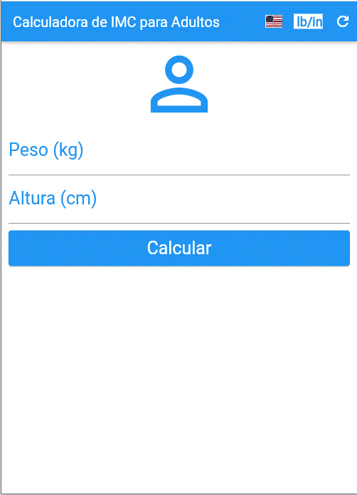
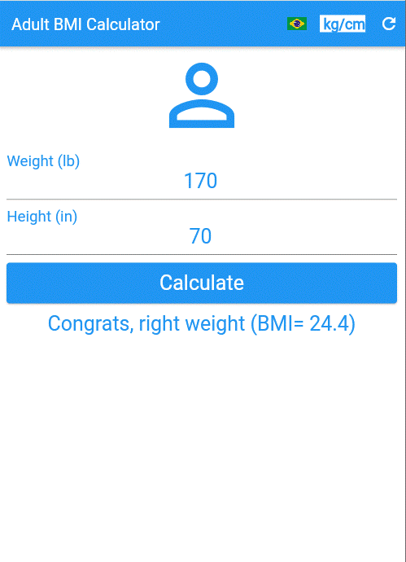
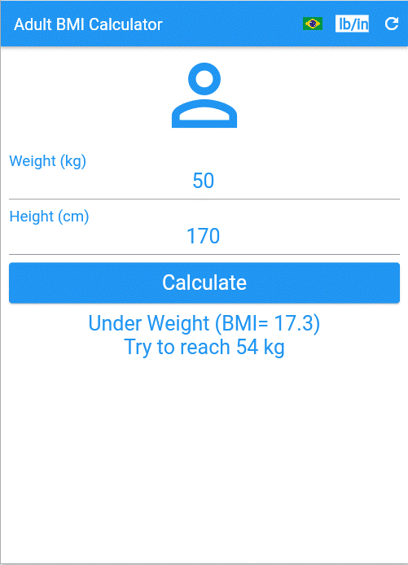
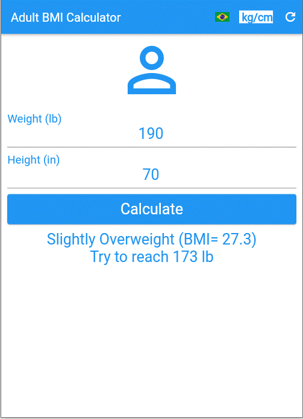
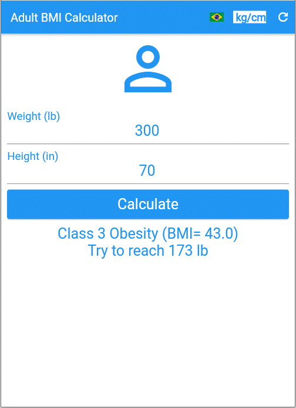

## **Una aplicación sencilla de Flutter para calcular el IMC en adultos**

# About
>Esta aplicación calcula el IMC (índice de masa corporal) en adultos.
>
> [Basado en el curso de Daniel Ciolfi en Udemy](https://www.udemy.com/share/101Wim3@bL2WBnXJOyqEFUkkRTTFBdyhqzpZ32Q6N7CTpyPFdVlf_9YG0WhJUuuvZelTMLrW/)
>
>  

# Aspectos:
> - Calcula el IMC solo para adultos.
> - Muestra pautas basadas en la clasificación de la FDA.
> - En inglés o portugués. (pulsa la bandera)
> - Use unidades de peso/altura en lb/in o kg/cm. (presione el botón de unidades)
> - Borrar datos o ingresar nuevos datos. (presione el botón de recargar)

# Diseños
>
> ## Página de inicio en inglés y unidades en lb/in.
> 

> ## La misma página después de presionar el botón 'kg/cm'.
> 

> ## La página anterior en portugués.
> 

> ## Ingresando algunos datos "saludables" y presionando calcular. (es)
> .

> ## Un ejemplo de persona con bajo peso: (en, kg/cm)
> 

> ## Un ejemplo de persona con sobrepeso: (en, lb/in)
> 

> ## Ejemplo de persona con obesidad clase 1 (pt, kg/cm)
> 

> ## Ejemplo de persona con obesidad clase 2 (pt, kg/cm)
> 

> ## Ejemplo de persona con obesidad clase 3 (en, lb/in)
> 