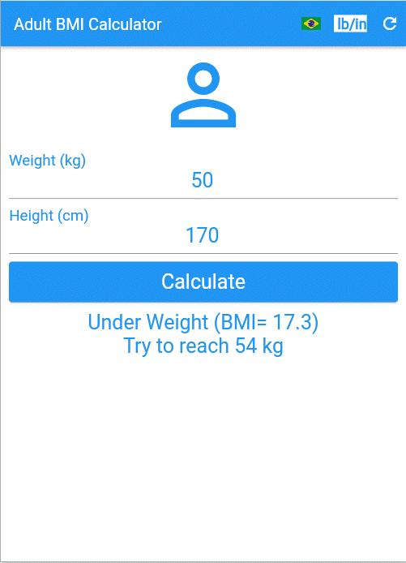
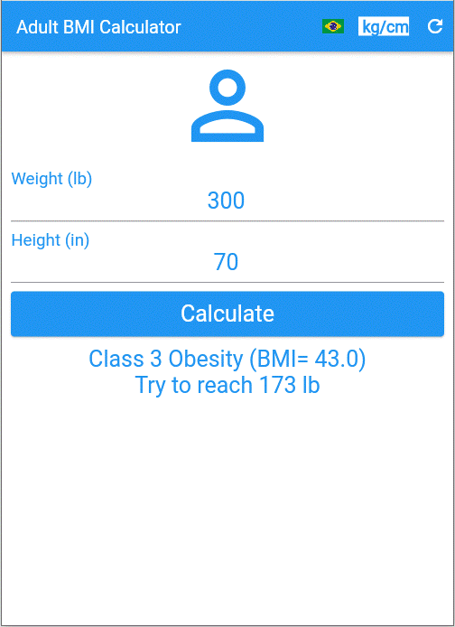

## **A Simple Flutter App for adult BMI Calculator**

# About
>This app calculates the BMI (Body Mass Index) for adult people.
>
> [Based on Daniel Ciolfi's udemy course](https://www.udemy.com/share/101Wim3@bL2WBnXJOyqEFUkkRTTFBdyhqzpZ32Q6N7CTpyPFdVlf_9YG0WhJUuuvZelTMLrW/)
>
>  

# Features:
> - Calculate BMI for adult only.
> - Show orientations based in FDA classification.
> - Set language to English or Portuguese. (press flag-button)
> - Set weight/height units to lb/in or kg/cm. (press unit-button)
> - Clear the data or input the new one. (press reload-button)

# Layouts
>
> ## The start page for English user in lb/in units
> 

> ## The same page after press the button kg/cm
> 

> ## The same page for Portuguese user
> 

> ## Let's insert some healthy data and press the calculate button
> 

> ## An example of an underweight person: (units in kg/cm)
> 

> ## An example of a slightly overweight person: (units in lb/in)
> 

> ## An example of a person with obesity class 1 (in Portuguese and kg/cm units)
> 

> ## The same example above for obsetity class 2: (in Portuguese and kg/cm units)
> 

> ## And, finally, an example of a obsesity class 3 person: (in English and lb/in units)
> 

# Tecnologies
> - Dart Language
> - Flutter Framework
> - I10n package

# Kick off
> - Compile to android or ios or web or windows.
> - Install and run.

# Pro version
> - Multi-user application.
> - Save results for future reference.
> - Set other languages.
> - Estimate a date for reaching a target weigh.
> - Many other configuration, security and logging features.

# Author
> Pedro Vitor Abreu
>
> <soft.pva@gmail.com>
>
> <https://github.com/softpva>