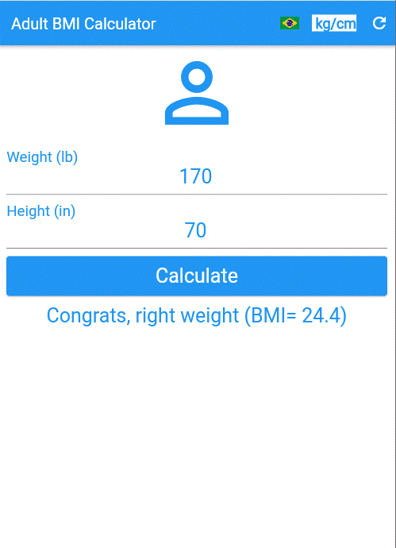

## A Simple Flutter App for adult BMI Calculator.

This app calculates the BMI (Body Mass Index) for adult people.

## Features:

This simple project was written in dart/flutter using l10n library to set user language, in the app you also can choose weight and height units in lb/in or kg/cm.

After press the calculate button the app shows the BMI value and an orientation text based in FDA classification.

You can change language, units or clear data at any time using the buttons in the top right corner of the app bar.

The blank start page for English user in lb/in units:

The same page after press the button kg/cm:

The same page for Portuguese user:

Let's insert some healthy data and press the calculate button:

An example of an underweight person: (units in kg/cm):

An example of a slightly overweight person: (units in lb/in):

An example of a person with obesity class 1 (in Portuguese and kg/cm units):

The same example above for obsetity class 2: (in Portuguese and kg/cm units):

And, finally, an example of a obsesity class 3 person: (in English and lb/in units):

[Based on Daniel Ciolfi's udemy course](https://www.udemy.com/share/101Wim3@bL2WBnXJOyqEFUkkRTTFBdyhqzpZ32Q6N7CTpyPFdVlf_9YG0WhJUuuvZelTMLrW/)

The muiti-user pro version app saves your results for future reference and estimates a date for reaching a target weight and and has many other configuration, security and logging features.
