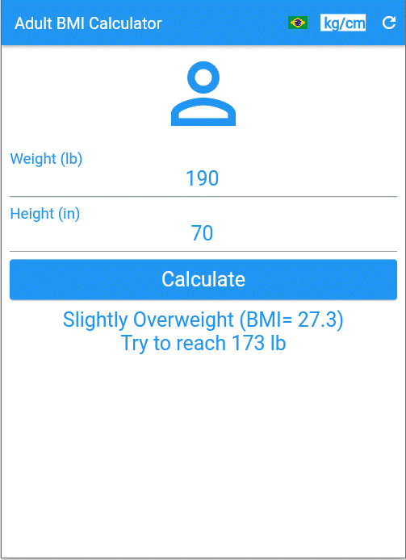
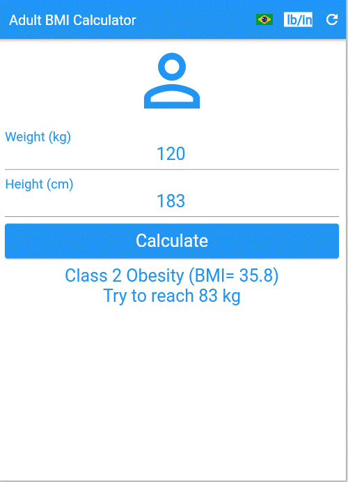

## **Um simples app em Flutter para cálculo do IMC em adultos**

# About
>Este aplicativo calcula o IMC (Índice de Massa Corporal) em adultos.
>
> [Baseado no curso de Daniel Ciolfi na Udemy](https://www.udemy.com/share/101Wim3@bL2WBnXJOyqEFUkkRTTFBdyhqzpZ32Q6N7CTpyPFdVlf_9YG0WhJUuuvZelTMLrW/)
>
>  

# Aspectos:
> - Calcula o IMC apenas para adultos.
> - Mostra orientações baseadas na classificação do FDA.
> - Em inglês ou português. (pressione a bandeira)
> - Usa unidades de peso/altura em lb/in or kg/cm. (pressione o botão de unidades)
> - Limpa os dados ou insira novos. (pressione o botão de recarregar)

# Layouts
>
> ## Página inicial em inglês e unidades em lb/in.
> 

> ## A mesma página após pressionar o botão kg/cm.
> 

> ## A página anterior em português.
> 

> ## Inserindo alguns dados "saudáveis" e pressionando calcular. (en)
> 

> ## Um exemplo de uma pessoa abaixo do peso ideal: (en, kg/cm)
> 

> ## Um exemplo de pessoa com sobrepeso: (en, lb/in)
> 

> ## Um exemplo de pessoa com obesidade classe 1 (pt, kg/cm)
> 

> ## Um exemplo de pessoa com obesidade classe 2 (pt, kg/cm)
> 

> ## Um exemplo de pessoa com obesidade classe 3 (en, lb/in) 
> 

# Tecnologías
> - Lenguaje Dart
> - FlutterFramework
> - Package I10n

# correr
> - Compilar para android o ios o web o windows.
> - Instalar y ejecutar.

# Versión Pro
> - Aplicación multiusuario.
> - Resultado guardado en db para uso futuro.
> - Fecha estimada para alcanzar un peso determinado.
> - Otros idiomas además del portugués e inglés.
> - Muchas otras configuraciones, seguridad e informes.

# Author
> Pedro Vitor Abreu
>
> <soft.pva@gmail.com>
>
> <https://github.com/softpva>